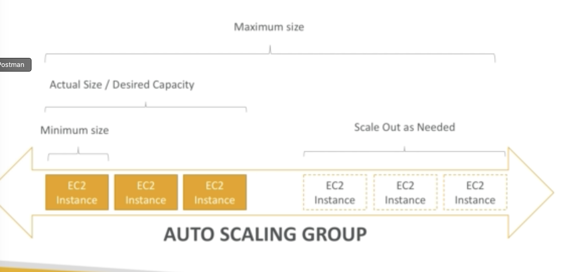

ASG is designed to scale out and scale in the ec2 instances that's running and they can ensure we either have a minimum or maximum amount of instances running. It can automatically register a new instance to ELB.

## ASG Scaling policies

They can be CPU, network or any custom ones.

They can use launch configuration or launch templates
