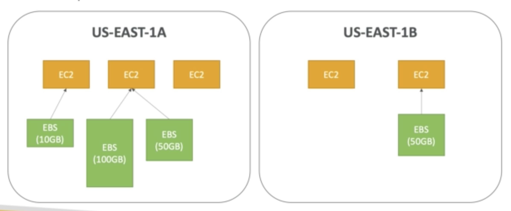

It is a place where you can safely store your instance data in case of unexpected instance termination.

It is a network drive which you can attach to your running ec2 instances

It can be detach and attach to another instance really quickly, however it is only within the same AZ.

## Volume Types

1. GPS
   - General purpose SSD
2. IOI
   - High performance SSD
3. STI
   - Low cost HDD with frequent access
4. SCI
   - Low cost HDD with infrequent access

## Instance store vs ESB

Some instance don't come with root ESB they come with instance store(temporary).

Instance store is **physically** attach to the instance.

### Pros

1.  Better IO(performance)
2.  Good for buffer

### Cons

1.  Entire store is lost upon reboot
2.  Can't resize
