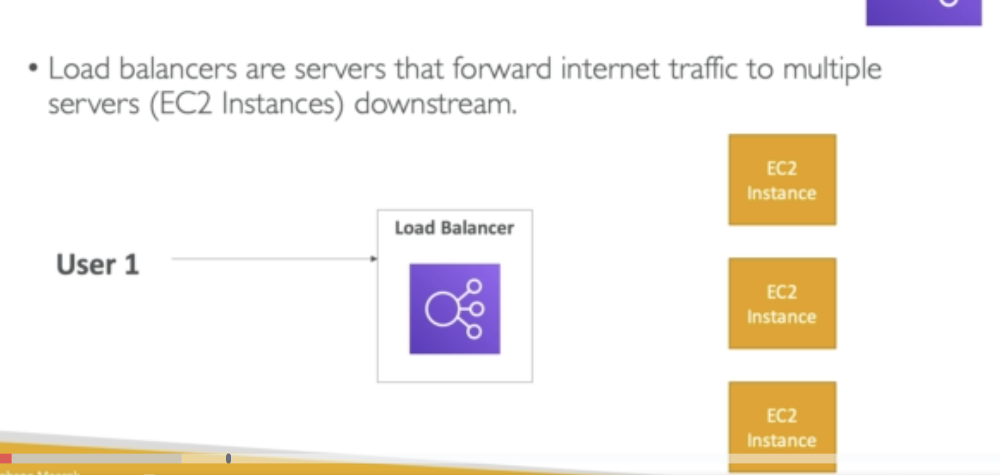

First scalability has 2 kinds, one is **vertical scaling** and the other is **horizontal scaling** and High Availability is in relation to scalability but not the same.

Vertical means scale the instance **UP**

Horizontal means increase the number of instances. **Horizontal**

### High Availability

Meaning that it is running on at least 2 data centers, it can survive a data center loss.

### Load balancer

## So why do we need it?

1. Spread load across multiple downstream instances

2. Expose a single point of access DNS

3. Handle failure of downstream instances

4. Regularly do health check on instances

5. Provide SSL

6. Ensure about cookie stickiness

7. High availability across zones

8. Separate public and private traffic
