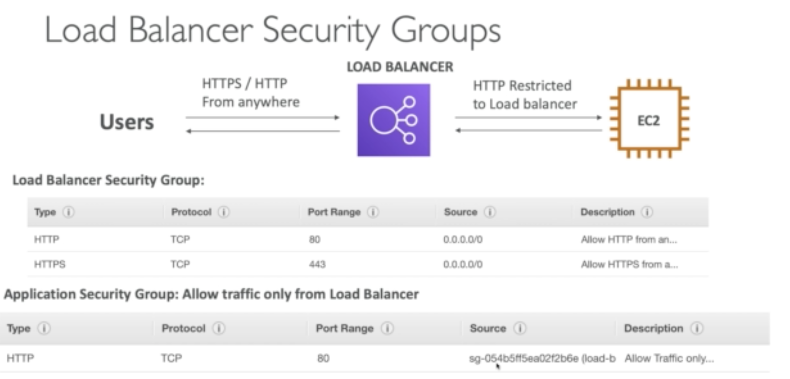
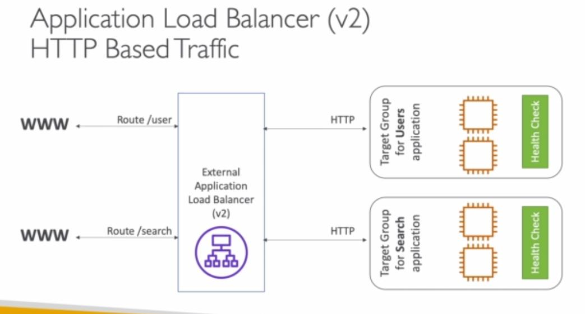
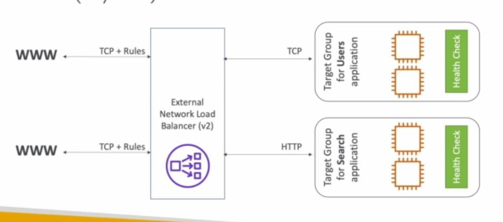
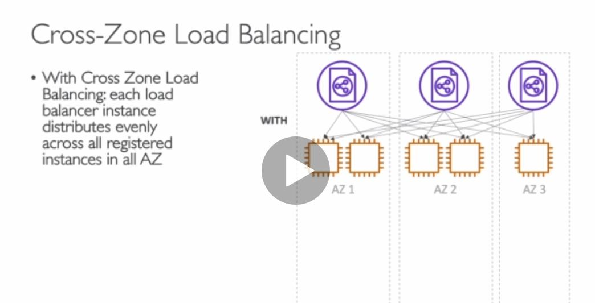
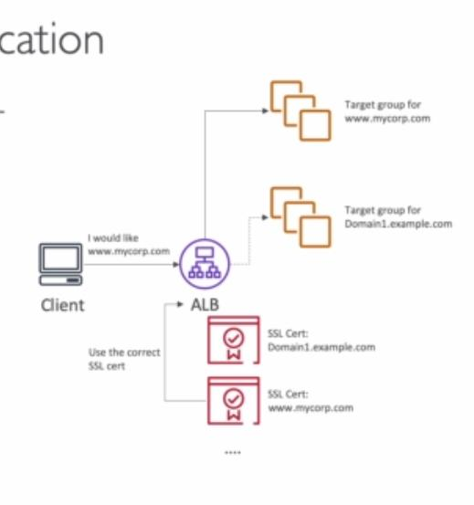

First scalability has 2 kinds, one is **vertical scaling** and the other is **horizontal scaling** and High Availability is in relation to scalability but not the same.

Vertical means scale the instance **UP**

Horizontal means increase the number of instances. **Horizontal**

### High Availability

Meaning that it is running on at least 2 data centers, it can survive a data center loss.

### Load balancer

## So why do we need it?

1. Spread load across multiple downstream instances

2. Expose a single point of access DNS

3. Handle failure of downstream instances

4. Regularly do health check on instances

5. Provide SSL

6. Ensure about cookie stickiness

7. High availability across zones

8. Separate public and private traffic

# Three Types of AWS managed load balancers

## Classic Load Balancer (HTTP,HTTPS,TCP) 2009 V1

## Application Load Balancer (HTTP,HTTPS,Websocket) 2016 V2

## Network Load Balancer (TCP,TLS,UDP) 2017 V2

## Load Balance stickiness

<u>It means same client always get directed to the same ec2 instance behind load balancer</u>

Applicable for Classic and Application Load balancer

<u>Use case: make sure a user doesn't lose his session data but it might bring inbalance to the instances.</u>

## Cross zone load balancer

Ditribute all traffic to all instances in all AZ evenly

## SSL/TLS

## Connection Draining

Time to complete the request while the instance is getting de register or terminated or unhealthy.

Stop sending request to the instance which is de registering
