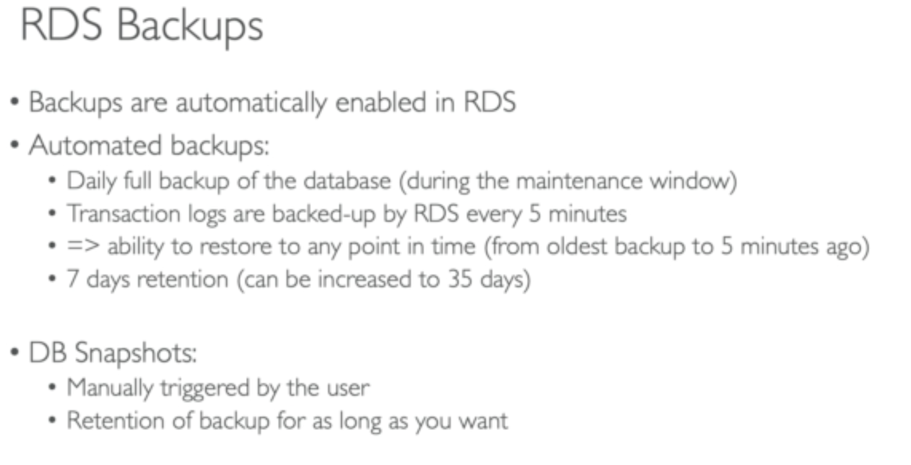
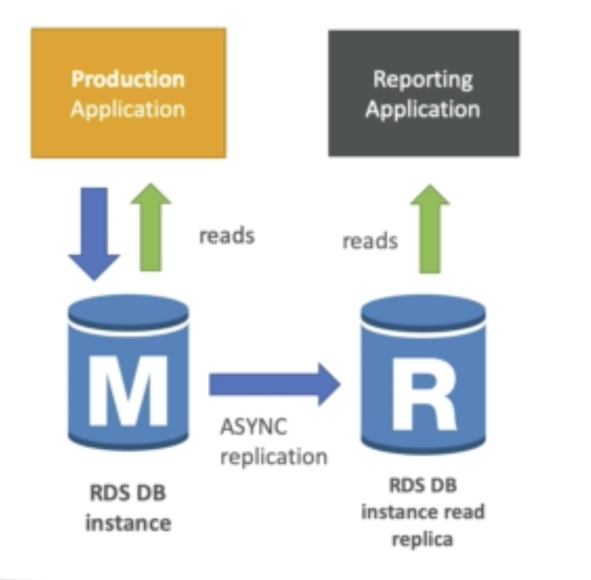

## DB engines managed by AWS

- Postgres

- Mysql

- MariaDB

- Oracle

- MS SQL Server

- Aurora

### Why use this instead of using your own DB on EC2?

1. Automated provisioning, OS patching

2. Continuous backup

3. Monitor dashboard

4. Read replicas

5. Multi AZ set up for diaster recover

6. Maintenance window

7. Scaling both vertically and horizontally

8. Storaged backed by EBS

## Backup Automatic

## Read Replicas

It helps only with read operation with dbs

**can make up to 5 read replicas**

**within AZ, cross AZ or cross region**

**Replications are async and will be eventually consistent**

**can be promoted to its own db**

**If you need to use read replicas, need to update the connection string in the main app**

### Use case:

### Network cost associated

if they are in the same zone, no cost but if they are in different AZ, there will be cost

## RDS Multi AZ (Diaster Recover)

- Sync replications

- Increase availability

- Not used for scaling

- No manual intervention in apps

- One DNS name, automatic app failover to standby

* **Read replicas can be set up as Multi AZ(disaster recover)**
