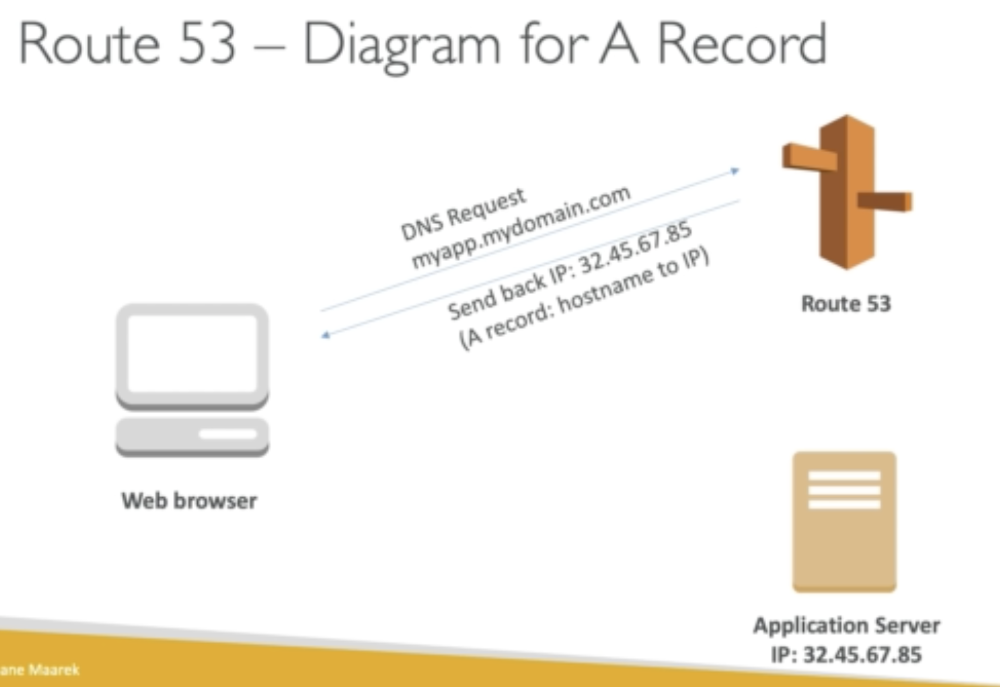

Route 53 is a managed DNS service by AWS:

**Main Records used by AWS**

<u>A Record: hostname to IPV4</u>

<u>AAAA: hostname to IPV6</u>

<u>CNAME: hostname to hostname</u>

<u>Alias: hostname to AWS resources</u>
