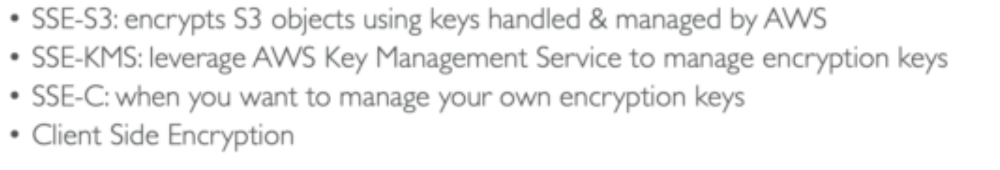

Bucket needs to have a globally unique name

They are defined at a region level

Naming restrictions:

- No uppercase

- No underscore

- No IP address

- Must start with a lowercase or number

- 3-63 characters long

**The Objects in the bucket have a key**

**The key is the full path:**

like:

s3://my-bucket/**myFile.jpg** or

s3://my-bucket/**dir/stuff/myFile.jpg**

the key is composed of **prefix** and **object name**

example: <u>prefix</u>---> **dir/stuff**

<u>object name</u>---> **myFile.jpg**

### There is no directory in bucket

## Encryption in S3

**SSE-S3**

- Encrypt and use the key managed by AWS

- Object is encrypted at server side

- AES-256 encryption type

- Must set header: **"x-amz-server-side-encryption":"AES-256"**

**SSE-KMS**

- Encrypt and use the key managed by KMS

- KMS has user control and audit trail

- Header: **"x-amz-server-side-encryption:":"aws-kms"**

**SSE-C**

- Encrypt and use keys managed by customer outside of AWS

- S3 doesn't store the keys

* Must use HTTPS

* Encryption key must be provided in every HTTP header for every request
