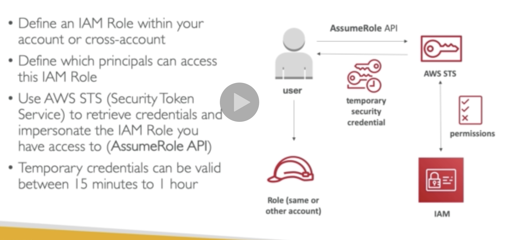
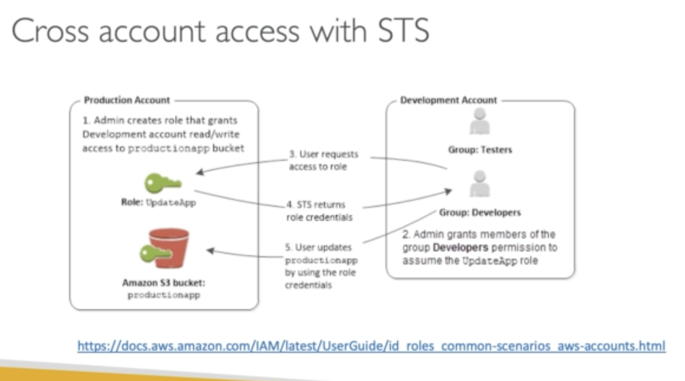

## STS (Security Token Service)

Allows temporary and limited access to AWS services (up to 1 hour)

- AssumeRole

- AssumeRoleWithSAML

- AssumeRoleWithWebIdentity

- GetSessionToken

- GetFederationToken

- GetCallerIdentity

* DecodeAuthorizationMessage

**How does it work?**

## Advanced IAM

## Grant user permission to pass role to AWS service

## Directory Service
