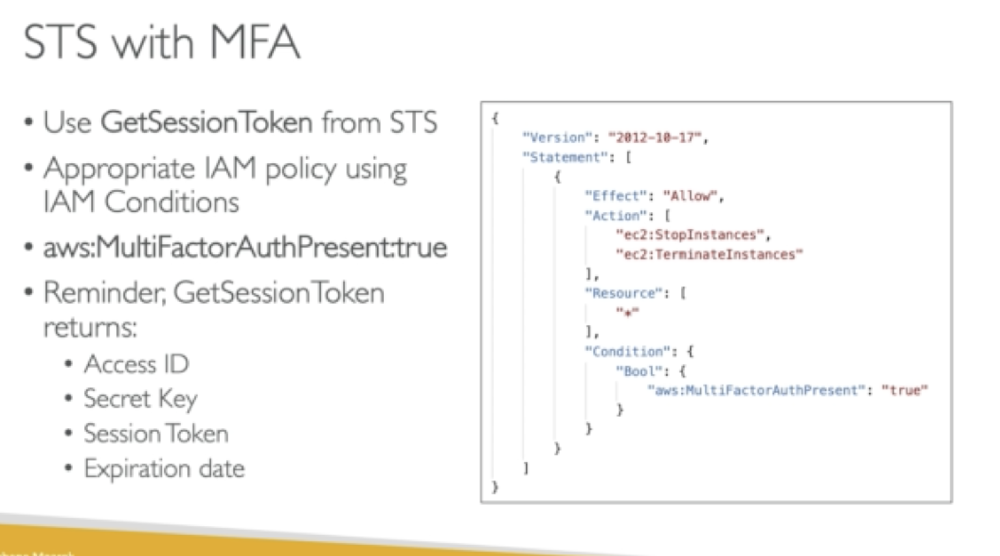
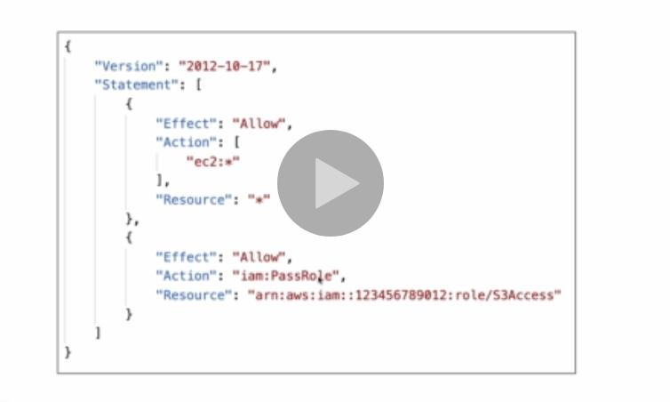
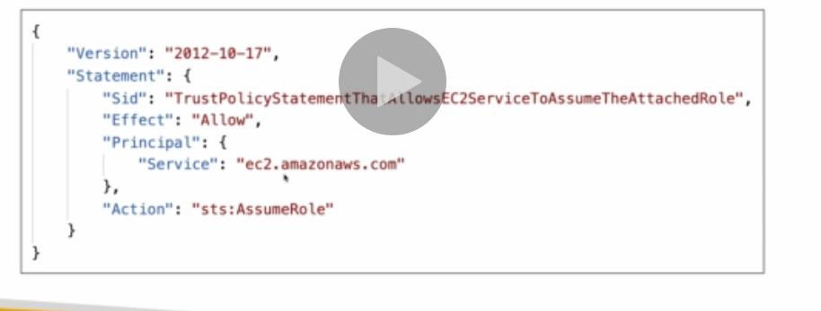
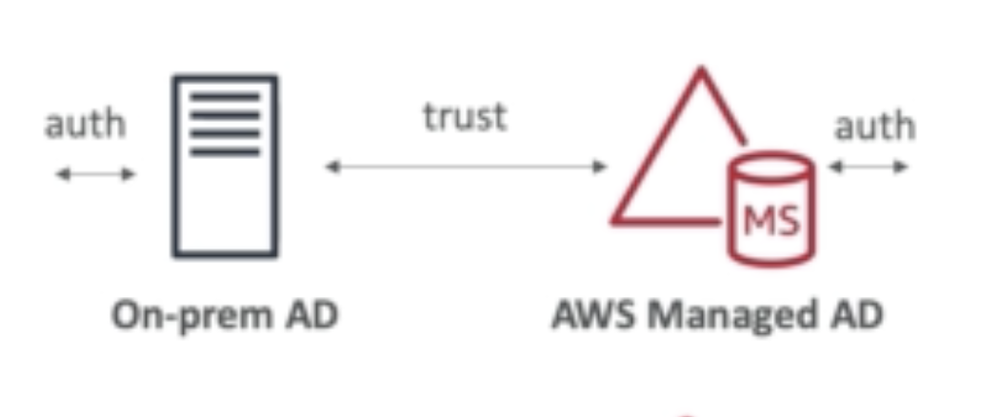
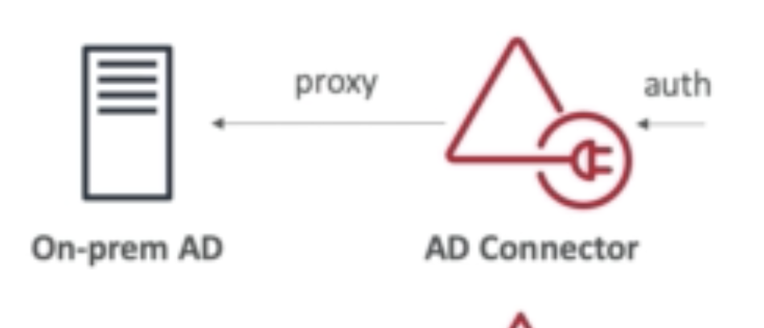

## STS (Security Token Service)

Allows temporary and limited access to AWS services (up to 1 hour)

- AssumeRole

- AssumeRoleWithSAML

- AssumeRoleWithWebIdentity

- GetSessionToken

- GetFederationToken

- GetCallerIdentity

* DecodeAuthorizationMessage

**How does it work?**

## Advanced IAM

## Grant user permission to pass role to AWS service

To configure many AWS services, you must pass an IAM role to the service.

The service will later assume the role and perform the actions.

Some examples are:

- To an EC2 instance

- To a Lambda function

- To an ECS task

- To CodePipeline to allow it to invoke other services

You need this: **iam:PassRole**
later you use **iam:GetRole** to view the role that is passed

### Can a role be passed to any services?

**Roles can only be passed to what their trust allows**

## Directory Service

It is a way to create something similar to MS Active Directory on AWS.

**AWS Managed MS AD**

Create your own AD in AWS, manage user locally and support MFA

Establish "trust" between your local AD

**AD Connector**

Proxy to redirects to on premise AD

Users are managed on premise AD

**Simple AD**

AD compatible managed directory on AWS

Cannot be joined with on premise AD

