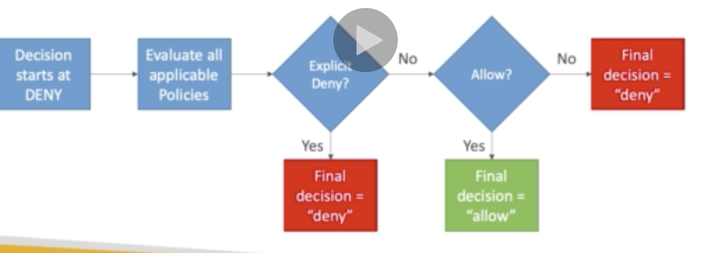
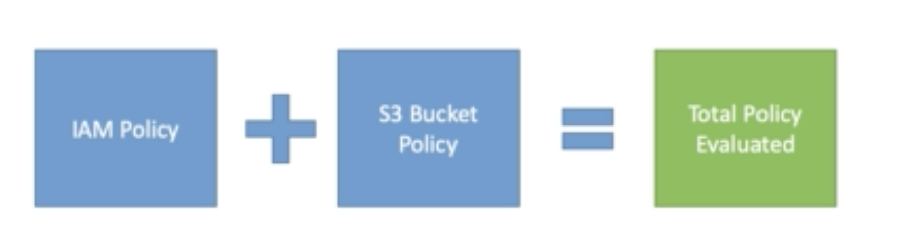

## STS (Security Token Service)

Allows temporary and limited access to AWS services (up to 1 hour)

- AssumeRole

- AssumeRoleWithSAML

- AssumeRoleWithWebIdentity

- GetSessionToken

- GetFederationToken

- GetCallerIdentity

* DecodeAuthorizationMessage

**How does it work?**


## Advanced IAM

### Dynamic policy

**How to create a bucket with /home/<user> in s3?**

1. create an IAM policy per user like:

/home/George
/home/Sarah
/home/Peter

2. Create Dynamic policy

Utilize a special variable: \${aws:username}

example snippet:

```javascript
{
  "Sid":"AllowAllS3ActionsInUserFolder",
  "Action":["s3:*"],
  "Effect":"Allow",
  "Resource":["arn:aws:s3::my-company/home/${aws:username}/*"]
}
```

### Inline policy vs Managed Policy

**AWS managed policy**

- Managed by AWS

- Good for admin and power users

- Regular updates

**Customer managed policy**

- Best practice and re usable

- Version controll and roll back

**Inline policy**

- Strict one to one relationship with principal and policy

### Authorisation Model explained

If there's an explicit DENY, the end result will be DENY

If ALLOW then all will end with ALLOW

Else everything else will be DENY



### IAM Policy and S3 Bucket policy evaluation

Whatever is evaluated is the union of both IAM and S3 bucket policy



## Grant user permission to pass role to AWS service

To configure many AWS services, you must pass an IAM role to the service.

The service will later assume the role and perform the actions.

Some examples are:

- To an EC2 instance

- To a Lambda function

- To an ECS task

- To CodePipeline to allow it to invoke other services

You need this: **iam:PassRole**
later you use **iam:GetRole** to view the role that is passed


### Can a role be passed to any services?

**Roles can only be passed to what their trust allows**


## Directory Service

It is a way to create something similar to MS Active Directory on AWS.

**AWS Managed MS AD**

Create your own AD in AWS, manage user locally and support MFA

Establish "trust" between your local AD


**AD Connector**

Proxy to redirects to on premise AD

Users are managed on premise AD


**Simple AD**

AD compatible managed directory on AWS

Cannot be joined with on premise AD


