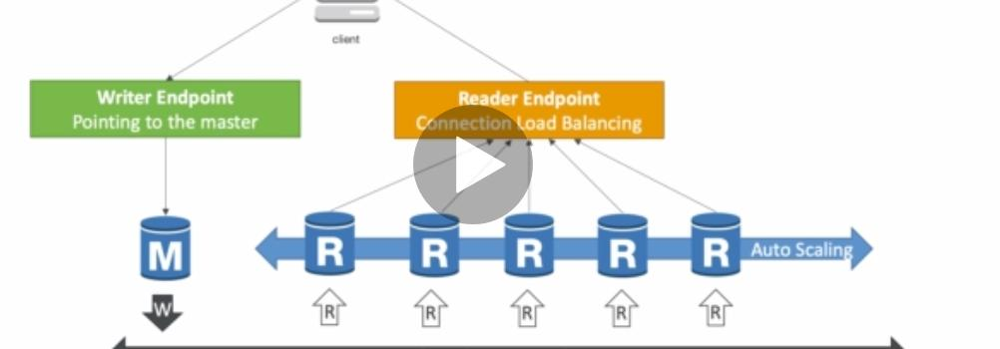
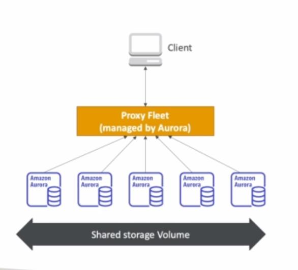

It is compatible with postgres and mysql.

Aurora is cloud optimized, it's 5x more performant than mysql and 3x more than postgres.

It can have up to 15 read replicas while mysql can only have 5.

Failed over is native and instantaneous

Aurora cost more than RDS but far more efficient.

### One endpoint for read and write

## Aurora Serverless

1. Automated db instantiation plus auto scaling

2. Good for infrequent, intermittent and unpredictable workload

3. No capacity planning

4. Pay per second
