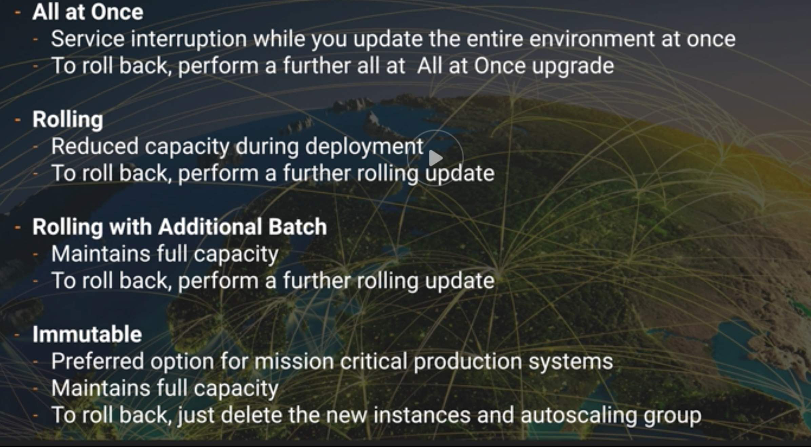

It is a PaaS service that only the code is needed to run an application with no need for infrastructure.

Just need to upload the code and Elastic Beanstalk will handle:

- Deployment

- Capacity provisioning

- Load balance

- Autoscaling

- Application health

## EBS Deployment policies

All at once

Rolling

Rolling with additional batch

Immutability ---> **Preferred for mission critical system**
