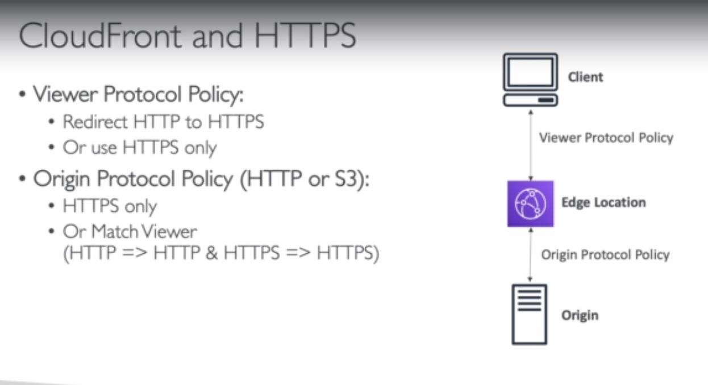
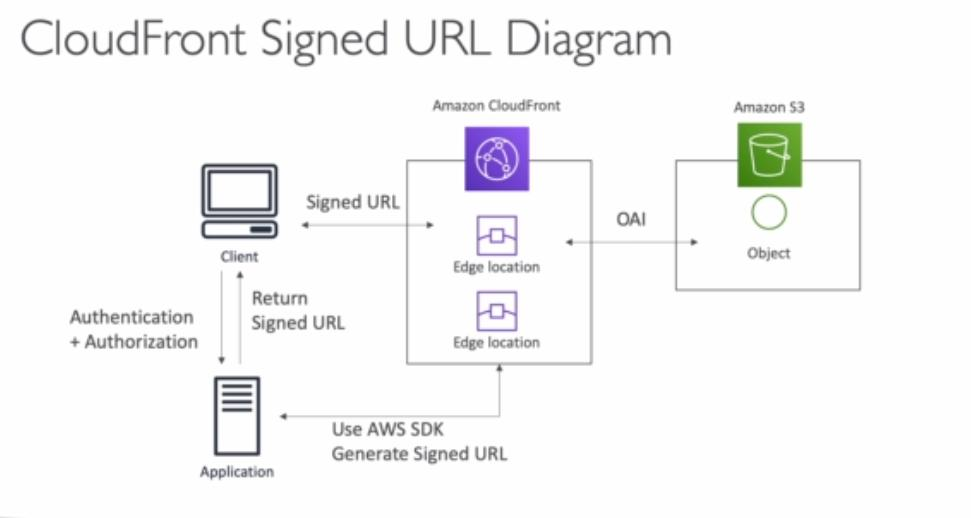

### Basic ideas

Amazon CloudFront is a content delivery network (CDN) offered by Amazon Web Services. Content delivery networks provide a globally-distributed network of proxy servers which cache content, such as web videos or other bulky media, more locally to consumers, thus improving access speed for downloading the content.

Basic idea is to create a cloud front distribution to access say your resources in S3 through **Origin Access Identity**, so only the url provided by cloud front will be able to serve data from your s3 bucket. Wheres you can keep s3 access private.

### Caching

It is based on **Headers**, **Session Cookies** and **Query String params**

It is best to maximize the cache hit rate to minimize requests on the origin

Control of the TTL can be set on origin(0 sec to 1 year)

CloudFront is smart enough to separate static and dynamic distributions.

Can set invalidation rule to flush the cache to get most recent contents or set the correct time to expires to fetch the most recent version.

### Security

**First way---> Geo Restriction: White list and black list**

The countries are determined by GEO-IP, a third party IP database

#### example

Copyright law to control access to content

**Second way--->**

Viewer Protocol Policy: Enable HTTPS only or redirect HTTP to HTTPS

Origin Protocol policy(HTTP or S3)

### Share private content

Can use **Signed URL** or **Signed Cookies**

How to do this?

Attach a policy that includes **URL expiration**, **IP ranges** and **Trusted signers**

What is a signed url? Access to individual files(one signed url per file)

What is a signed cookie? Access to multiple files(one signed cookies for many files)
