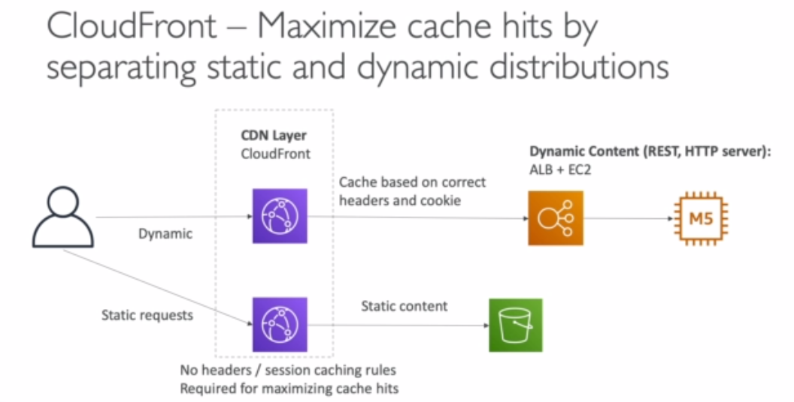

### Basic ideas

Amazon CloudFront is a content delivery network (CDN) offered by Amazon Web Services. Content delivery networks provide a globally-distributed network of proxy servers which cache content, such as web videos or other bulky media, more locally to consumers, thus improving access speed for downloading the content.

Basic idea is to create a cloud front distribution to access say your resources in S3 through **Origin Access Identity**, so only the url provided by cloud front will be able to serve data from your s3 bucket. Wheres you can keep s3 access private.

### Caching

It is based on **Headers**, **Session Cookies** and **Query String params**

It is best to maximize the cache hit rate to minimize requests on the origin

Control of the TTL can be set on origin(0 sec to 1 year)

CloudFront is smart enough to separate static and dynamic distributions
