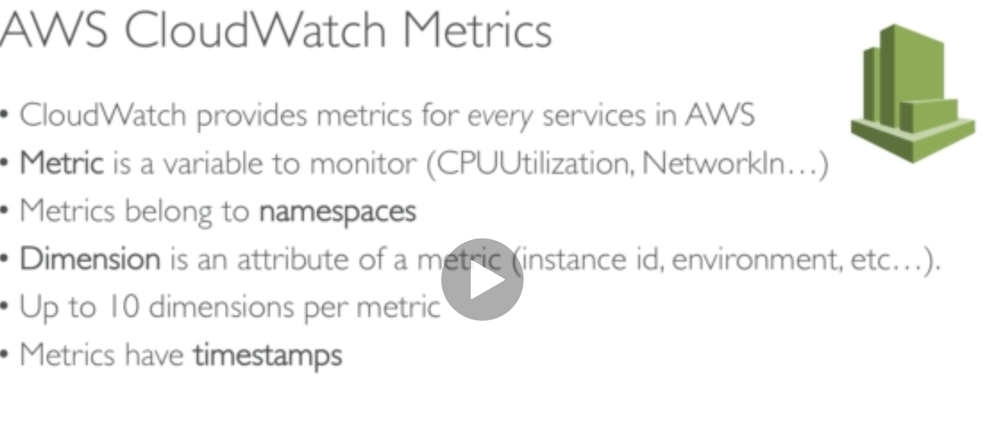
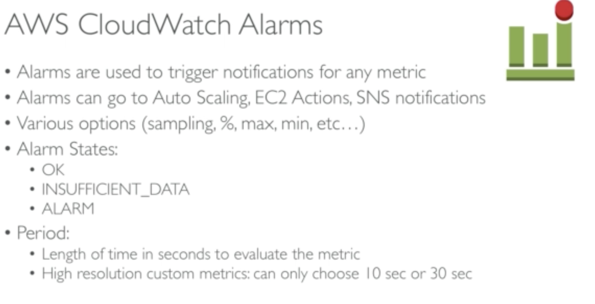

It enables monitoring for your aws applications:

**It does the follow:**

- Metrics: Collect and track key metrics

- Event: Send notification when certain events happen

- Log: Collect, analyze and store logs

- Alarm: React in real time metrics/events

### Metrics

EC2 instance have default metrics for "every 5 minutes" but with detailed monitoring you could get monitoring for "every minute". Use detailed monitoring if you want to prompt scale of ASG

### Alarms

