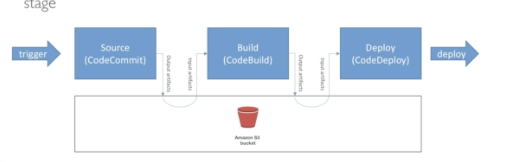

# CodeBuild

Source code from github/bitbucket/codeCommit/codePipeline/etc...

Leverages the docker technology

Build spec to be defined in file **buildspec.yml**

Outputs logs to AWS S3 and Cloudwatch logs

Builds can be defined in CodePipeline or CodeBuild itself

# CodePipeline

Performs continuous delivery

**Common troubleshooting**

- State changes in AWS CloudWatch events

- If any stages fail, it will stop but you can check console

- Check iam role if pipeline can't perform certain actions
