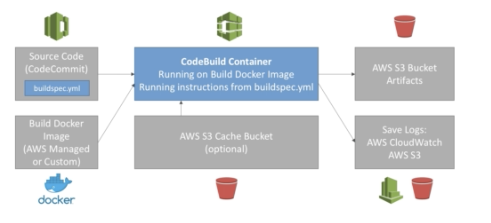

# CodeBuild

Source code from github/bitbucket/codeCommit/codePipeline/etc...

Build spec to be defined in file **buildspec.yml**

Outputs logs to AWS S3 and Cloudwatch logs

Builds can be defined in CodePipeline or CodeBuild itself

# CodePipeline
