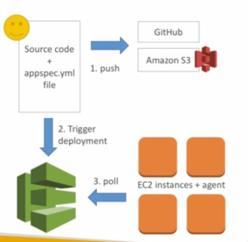

**Each EC2 instances that you deploy to must have something called CodeDeploy Agent running**

### Appspec, appspec.yml

Consists of :

1. File section: How to source and copy code from S3 or github or any repos.

2. Hooks: Set of instructions on how to deploy new version.

Correct Order

- ApplicationStop

* DownloadBundle

* BeforeInstall

* AfterInstall

* ApplicationStart

* Validate Service
