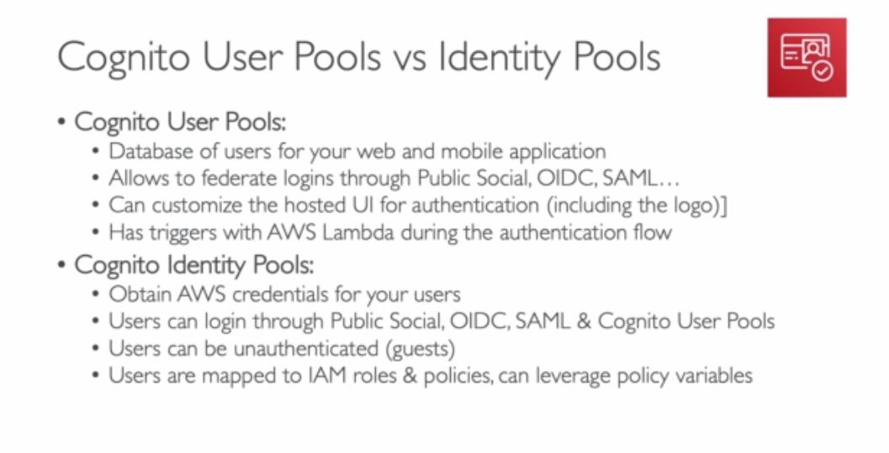

Giving user identities so they can interact with our applications

- **Three Cognito features**

  1. Sign in functionality
  2. Provide AWS credentials to users so they can access AWS resources directly
  3. Sync data (now is replaced by Appsync)

### What is the difference between IAM and Cognito?

_IAM is for users inside the AWS environment_, Cognito is for everything else invovles authentication and authorization.

### Cognitio is a database of users

### What is the difference between user pool and identify pool?

User pools are for authentication (identify verification). With a user pool, your app users can sign in through the user pool or federate through a third-party identity provider (IdP).

Identity pools are for authorization (access control). You can use identity pools to create unique identities for users and give them access to other AWS services.

