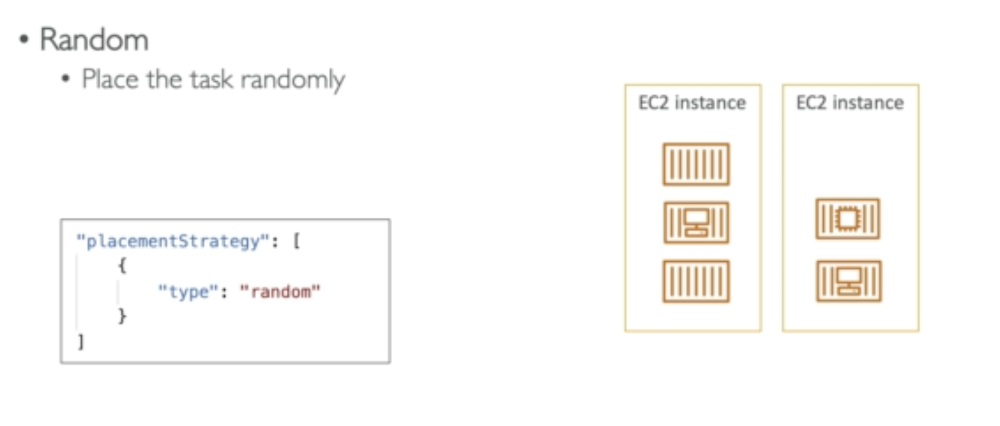

## ECS (Elastic Container Service)

They are logical grouping of EC2 instances

EC2 instance run an ECS agent (Docker Container)

ECS agent then register the instance to the ECS cluster

**Task Definitions**

They are in JSON form of metadata and tells ECS how to run a docker container.

Crucial information included are:

- Image name

- Port binding for container and host

* Memory and CUP

* Environment variable

* Network information

## ECS Service

This defines how many services should be run and how they should run it across the EC2 fleets.

They can be linked to NLB/ELB and ALB is necessary

**ECS service with load balancers**

## ECR

It is a private Docker images repository

Access control is done through IAM

Version 1 and Version 2 logins:

## Fargate

Before Fargate:

- We have to create our own EC2 instances when launching an ECS cluster

- If we need to scale, we need to add our own EC2 instances.

- Therefore we need to manage infrastructure.

After Fargate:

- All serverless

- No need to provision EC2 instances

- Just need to create task definitions and AWS run it for us

- To scale, just need to increase the task number, no more EC2s.

## ECS IAM

**EC2 Instance Profile Role**

- Used by the ECS agent

- Make api call to ECS service

- Send container log to CloudWatch logs

- Pull docker images from ECR

**ECS task role**

- Allow each task to have a specific role

- Use different task role for different ECS service you run.

* Task role are defined in Task Definitions

## ECS Task and Restraint

When a type of EC2 instance is launched, ECS must determine where to place it with the constraints of CPU, memory and available ports.

As well as when we scale a service, ECS needs to know which service to terminate.

This is where you can define **Task placement strategy** and **Task constraints placement**

### Task Placement Process

1. Identify the instance that satisfy the cpu, memory and ports requirements in the task definition.

2. Identify the instance that satisfy the task placement constraints.

3. Identify the instance that meets the task placement strategy.

4. Select instance for task placements

### Task placement strategies

### Task placement constraints

## ECS Autoscaling

Lots of things like CPU and Ram are tracked in CloudWatch on a ECS service level.

From there we can do:

- Target tracking: Target a specific average in CloudWatch metric.

- Step scaling: scaled based on CloudWatch alarm

- Schedule scaling: Base on predictable changes

**Fargate auto scaling is much easier to set up**

### ECS Cluster Capacity Provider

It is used in association with a cluster to determine the infrastructure the tasks runs on.

**When you run a task on a service, you define a capacity provider strategy, to prioritize which provider to run**

## ECS summary

It is mainly used to run dockers on EC2

Three flavors:

1. ECS Classic

2. ECS Fargate

3. EKS: Manage kubernetes by AWS

**ECS Classics**

EC2 instance must be created.

Must configure /etc/ecs/ecs.config with the cluster name

EC2 must run an ECS agent

EC2 instance can run multiple containers on the same type:

- You must not specify host ports

- You should use application load balancer with dynamic port

- The EC2 security group must allow traffic from ALB to all ports
