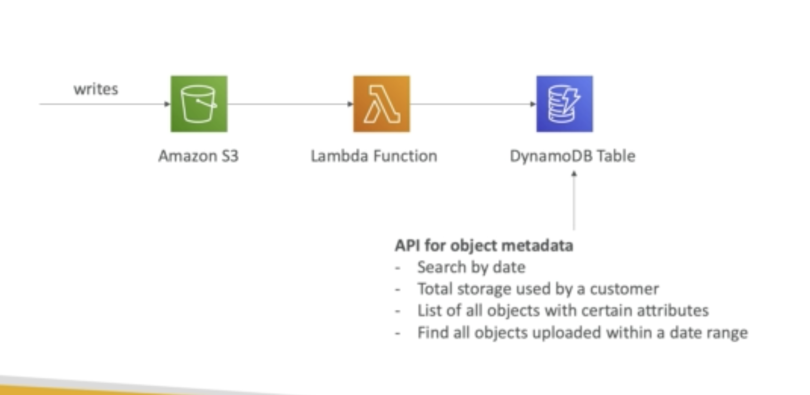

## DynamoDB conditional write, atomic write and concurrent write

Concurrent write will always favours whoever writes last to the database but with conditional write implemented you can use the condition to determine who's writes overwrites the others.

Atomic writes is like you take the value modified by the first person and then add the value changed by the second person.

## DynamoDB pattern with S3

## DynamoDB operation

- Table cleanup

  1. scan and delete: expensive operation

  2. just drop the whole table: cheap and efficient

* Copy a table

  1. use AWS data pipeline.

  2. create a backup and restore the backup in a new table name

## DynamoDB security

- VPC endpoint available without accessing to the internet

- Access controlled by IAM

- Encryption at rest using KMS

- Encryption in transit using SSL and TLS
