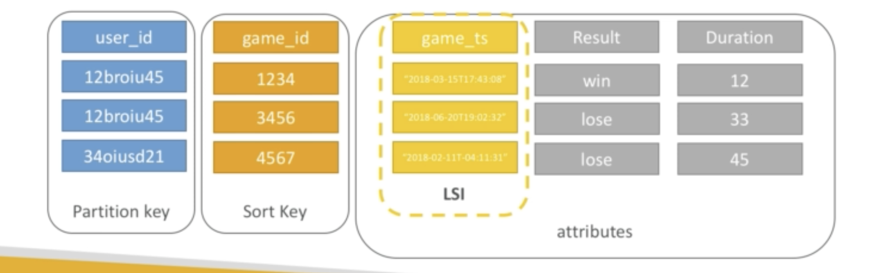
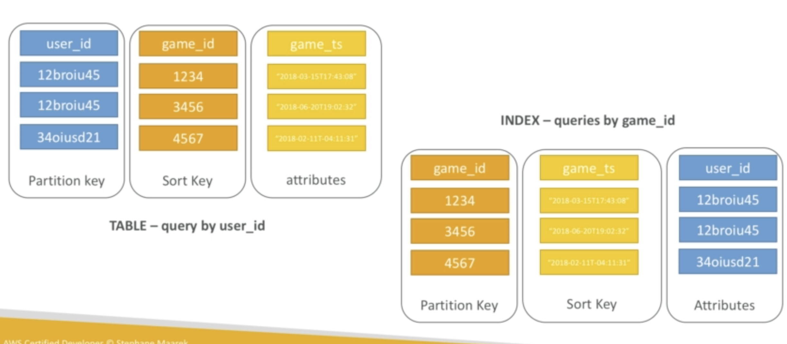

## Local Secondary Index (LSI)

It is an alternate range key for your table, local to the hash key.

Up to five secondary index key per table.

The sort key consists of exactly one scalar value:

- String

- Number

- Binary

**LSI must be definted at table creation time**

Example of secondary key being a time stamp

## Global Secondary Index (GSI)

To speed on query on non key attribute.

GSI = Partition key + optional sort key

The index is a new table and we can project attributes to it.

Must define WCU and RCU for the table

Possible to modify GSI (not LSI)

