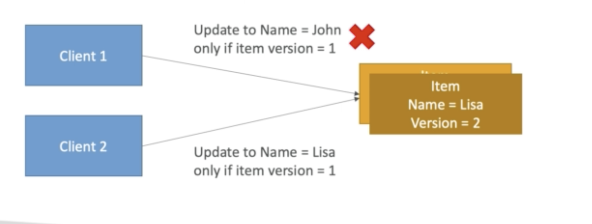

## Concurrency model

There is a feature that does Conditional update and Delete

This ensure the item hasn't been changed before alteration

This makes DynamoDB **Optimistic Locking** type of database

### A quick example:

