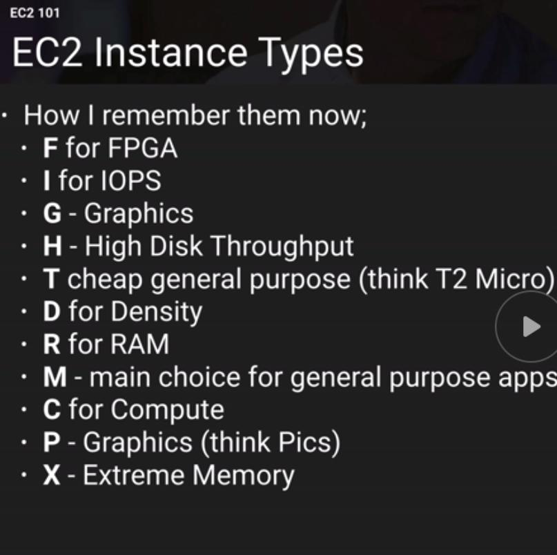
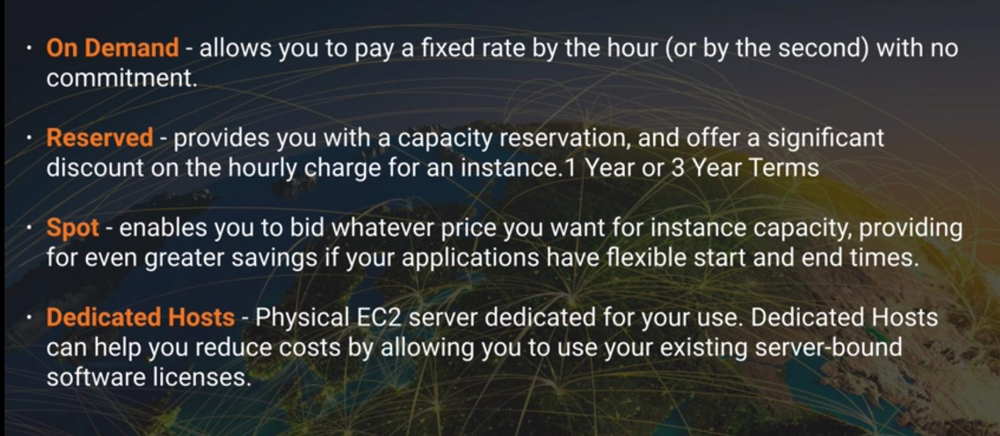

EC2 is a virtual computing environment, that enables customers to use Web service interfaces to launch instances with a variety of operating systems, load them with your custom applications, manage your network's access permissions, and run your image using as many or few systems as you need.

## Different instances Types

## EC2 plans

