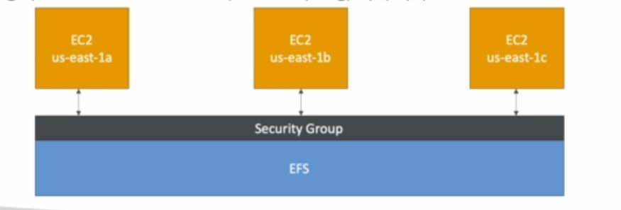

It is a managed network file system that can be mounted to any ec2 instances.

High available, highly expensive about 3x the price of gp2 but pay per use

* **Use cases**

      1. Content management, web serving, data sharing and Wordpress
      2. Use security group to control access to EFS 
      3. Only able to be used by linux instances not Window
      4. NFS file system 
      
### EFS Scale 

1000s concurrent client

Grow to peta byte size 

### EFS Performance mode 

General purpose 

Max IO

### Storage tiers 

Standard 

Infrequent access(EFS-IA): cost to store files, lower price to store

## Difference between EBS and EFS

*EBS can only be attached to one instance at a time*

*EBS is locked at the AZ*

*Root EBS get terminated if ec2 gets terminated(can disable that)*

**EFS can be mounted to 100s of instances across AZ**

**EFS only for linux**

**EFS is more expensive**

