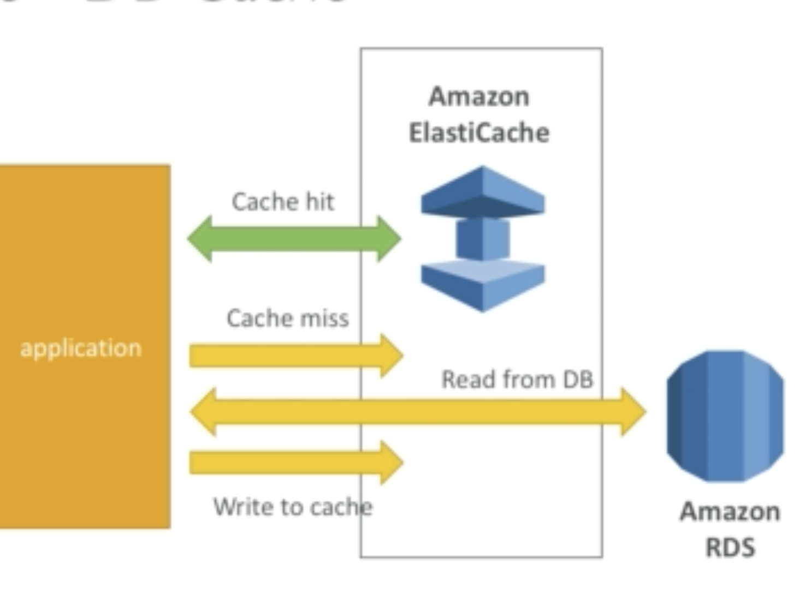
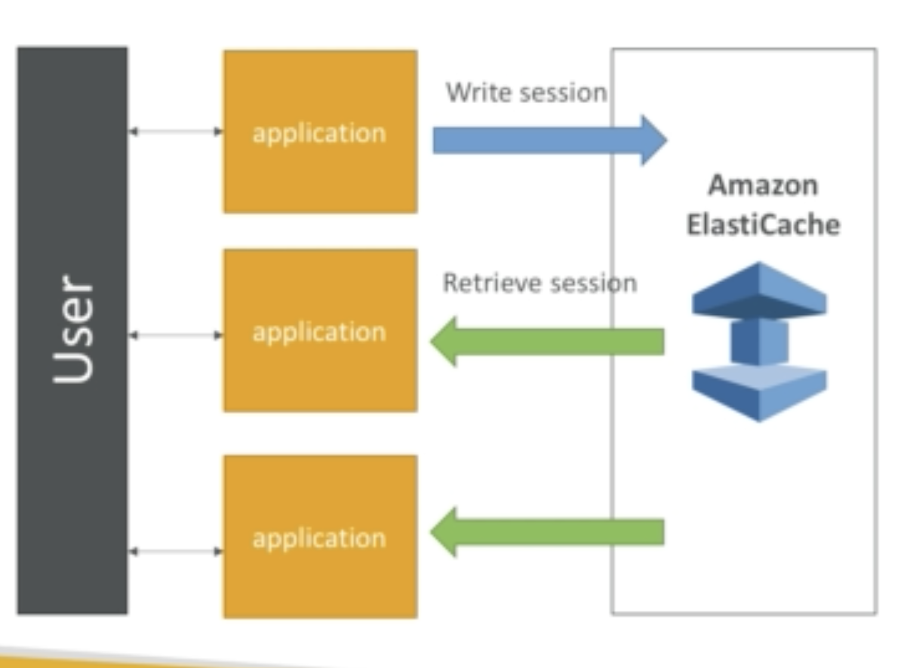
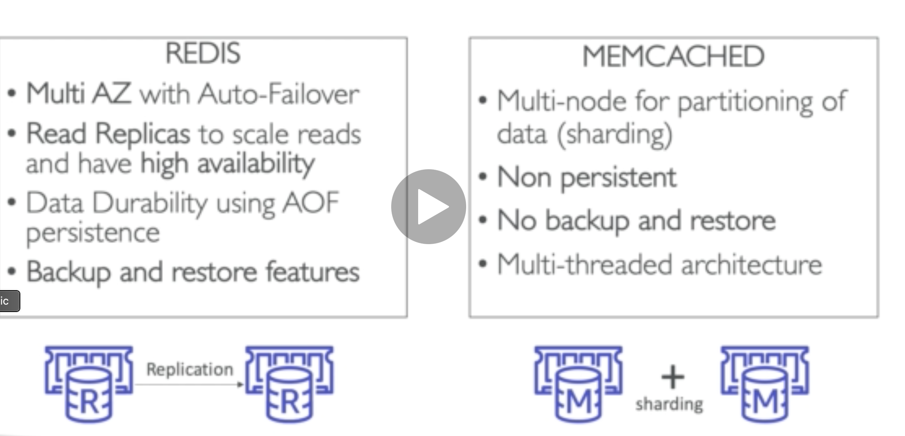

It is a managed db cache service with Redis or Memcached.

Basic idea is for the application to query the Elastic Cache if it's a hit it reads from Elastic cache and if it's a miss then it will query RDS or whatever db and store that result in Elastic Cache.

## Example for a user session store

## Memcached vs Redis

### Cache strategy

**Lazy loading/Cache Aside/Lazy population**

<u>Pro</u>

1. Only requested data is cached

2. Node failure is not fatal

<u>Con</u>

1. Cache miss penalty means 3 round trip

2. Stale data, outdated data in cache.
