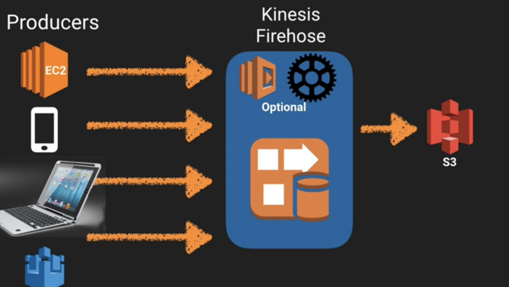
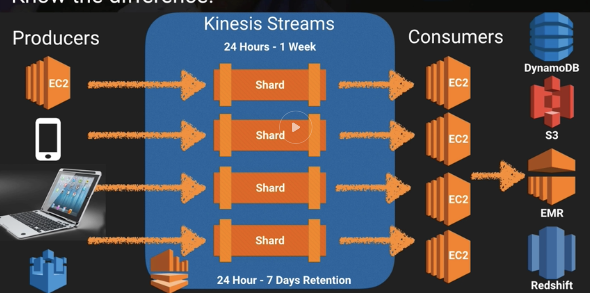

An AWS service that handles streaming of data

**Kinesis Firehose**

All automated with firehose

**Kinesis stream**

Producers like an ec2 instance or a laptop that sends data to Kinesis Stream, it then stores in shards and then send to fleet of ec2 to process them.

**Kinesis Analystics**
