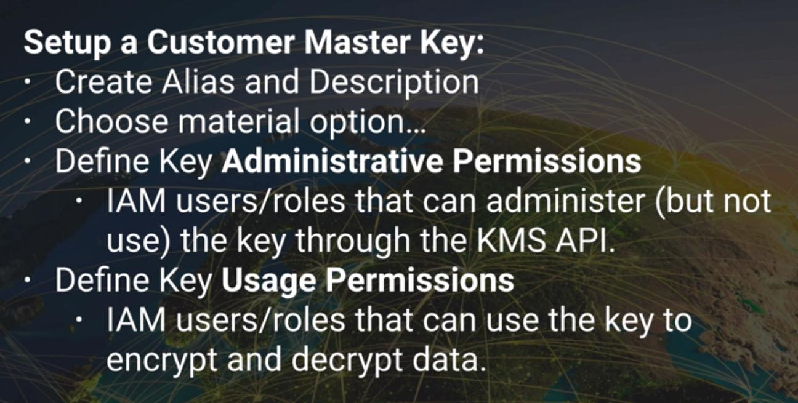

AWS KMS offers service for managing encryption key used to encrypt your data

**Encryption keys are regional**

Assigned users for either administrative usage or encrypt/decrypt usage for the KMS key.

## The API for AWS KMS 

1) AWS KMS encrypt

2) AWS KMS decrypt

3) AWS KMS re-encrypt

4) AWS KMS enable-key-rotation