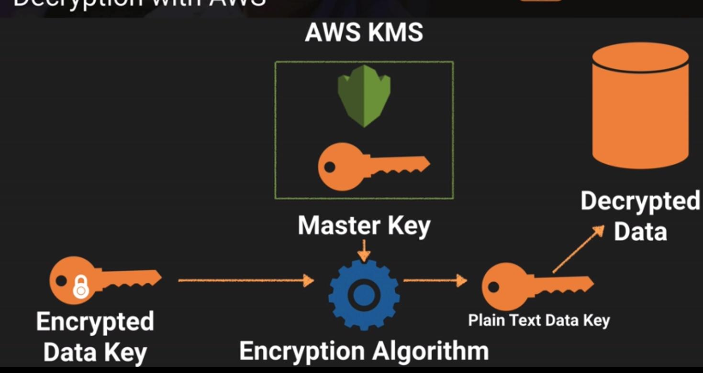

AWS KMS offers service for managing encryption key used to encrypt your data

**Encryption keys are regional**

Assigned users for either administrative usage or encrypt/decrypt usage for the KMS key.

## The API for AWS KMS 

* aws kms encrypt

* aws kms decrypt

* aws kms re-encrypt

* aws kms enable-key-rotation

## Envelope Encryption 

Custome Master key is used to decrypt the data key and the data key(envelope key) is used to decrypt the actual data

