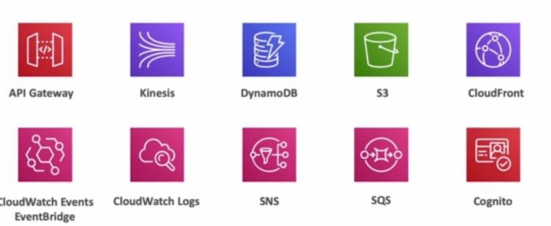

Virtual functions that have no servers to manage.

Limit execution time.

Running only on demand.

Scaling is automated.

## Benefits

1. Easy pricing

2. Easy integration with other AWS services

3. Easy monitoring with AWS Cloudwatch

4. Can get more resource per funtions (up to 3gig of RAM)

## Languages supported

1. NodeJS

2. C#

3. Java

4. Python

5. Golang

6. Ruby

**Docker is not running on lambda**

## Main servies integrations

