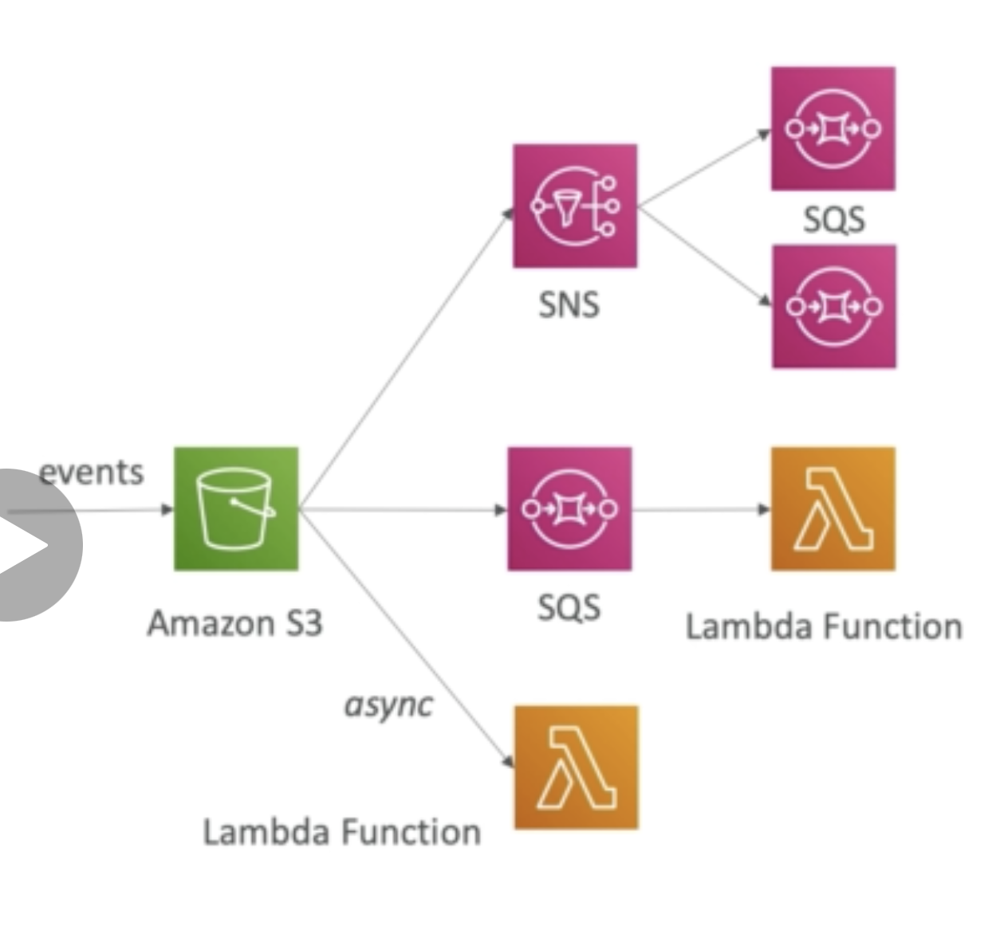

## Lambda Async Invocations

- AWS S3

- AWS SNS

- AWS CloudWatch event

### Examples of CloudWatch event/event bridge to connect to Lambda

1. Cron job

2. Codepipeline triggered on state changes

### AWS S3 example with lambda

1. Object created

2. Object removed

3. Object replicated

4. Object updated

### Typical event

(file event)
S3Bucket ----> Lambda---> RDS or DynamoDB
