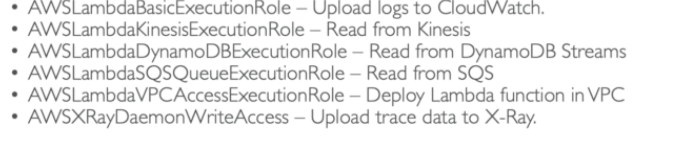

## Lambda Execution roles

**An iam role must be attached to lambda to use AWS services or resources**

**Best practice**

_Create one execution role per lambda function_

examples:

## Resource based policy

Other aws services can invoke lambda if there's policy defined from their resources for access

## Lambda Logging and Monitoring

- Cloud Watch Logs

- Cloud Watch Metrics

- X-ray
