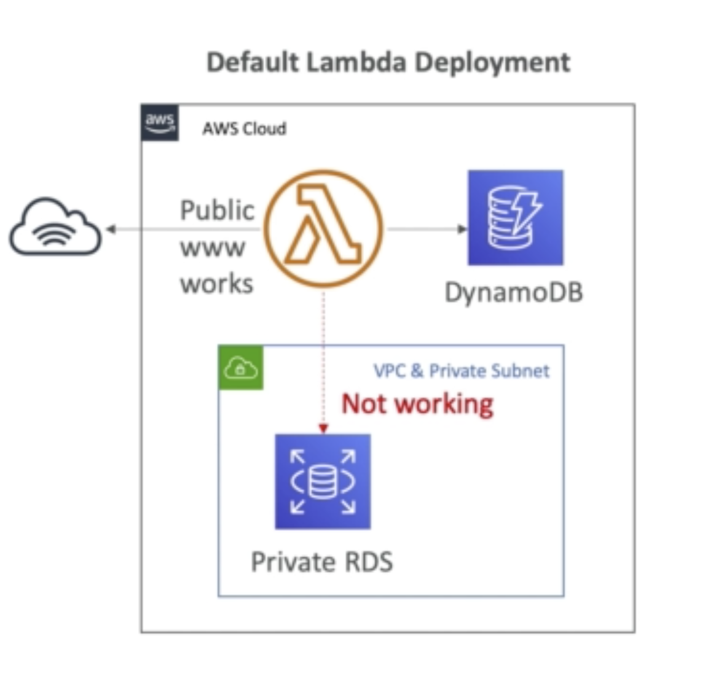
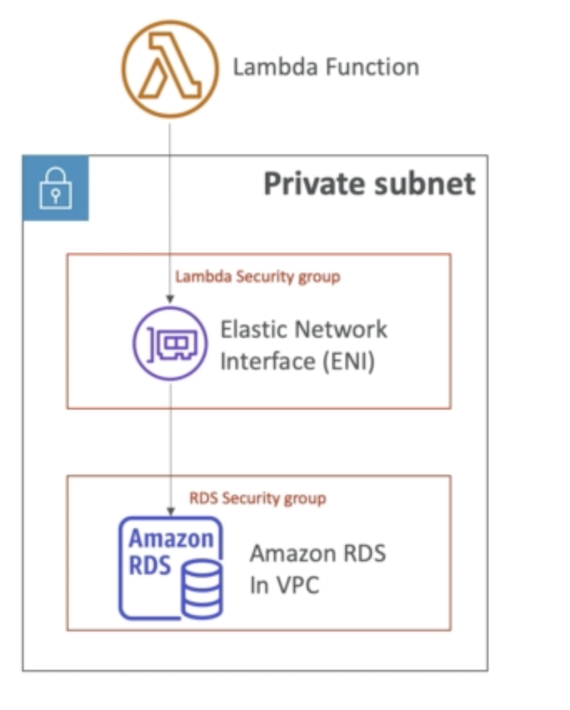
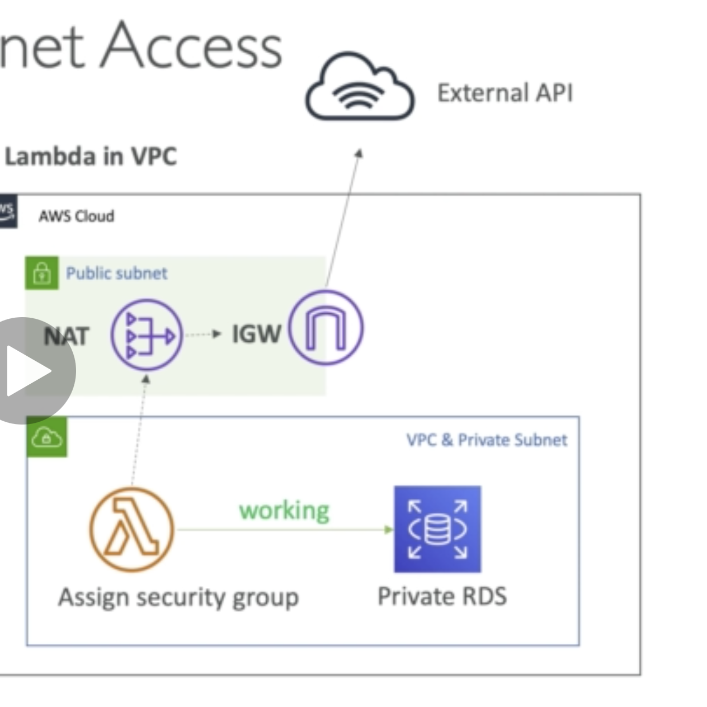

## Lambda and VPC

By default Lambda cannot access resources within your own VPC like RDS or Elastic Cache.

### Lambda in VPC

1. You must define VPC ID, subnet group and security group

2. Lambda will create ENI in your subnet

3. Must have AWSLambdaVPCAccessExecutionRole enabled

**It will not have internet access however...**

