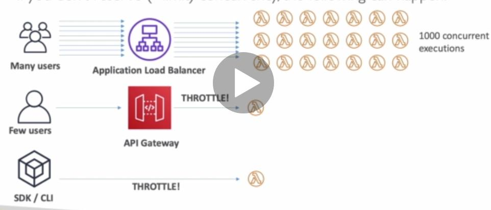

## Lambda Concurrency

Concurrency limit up to 1000 lambda executions.

Can set a "reserved concurrency" at a function level.

Each invocation over the currency limit will trigger a "Throttle"

### Possible issue

Concurrency limit happens to all the functions in your account.

So if one function is executing like below, all other functions will be affected.

