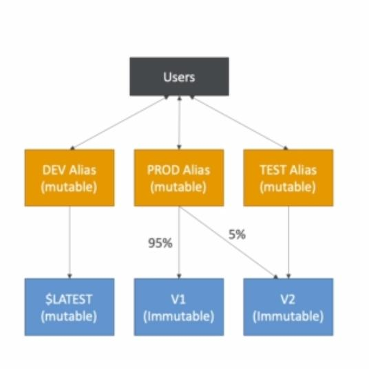

## Lambda external dependencies

If the size is less than 50mb it will be uploaded straight to lambda in zip file otherwise it will go straight to S3.

## Lambda and Cloudformation

You can use the lambda function in cloudformation inline style however you won't be able to include any external dependencies.

Otherwise you can utilize s3, refer to the location of s3 in the cloudformation code to use it.

## Lambda Aliases

They are pointer to different version of lambda functions.

We normally define "dev", "test", "prod" and have them point to different versions.

They have their own ARN(Amazon Resource Number)

They can't reference aliases

**They can enable blue/green deployment which assign weights to lambda functions**

