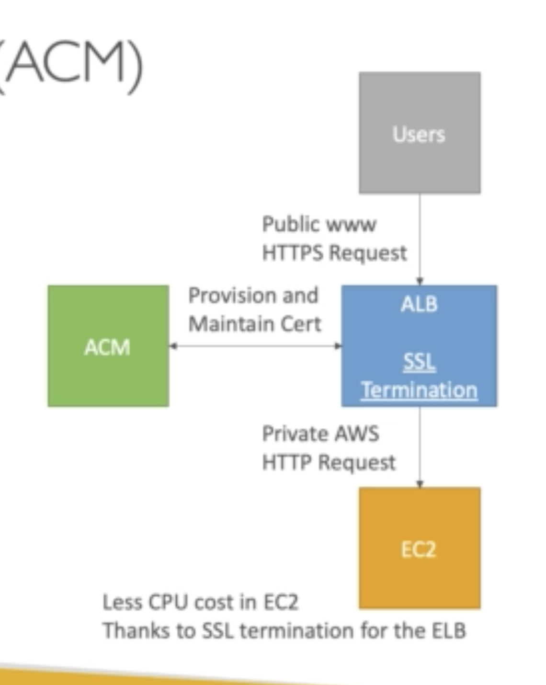

## SES

Amazon Simple Email Service:

- Send Email to people with: SMTP or AWS SDK

- Receive email and integrate with: Lambda, SNS and S3.

- Integrate with IAM to allow sending emails

## ACM (Amazon Certificate Manager)

Mainly used for SSL certificates, you can upload your own or you can use the ones provisioned by ACM

It is used in the following way:

- Load Balancer

- Cloudfront Distribution

- API gateway

## Misc topics for (OTLP, OLAP, NOSQL, Cache)

**AWS Database summary**

### RDS:

Postgres and Aurora

### DynamoDB:

NoSQL DB

Elasticache:

in memory database, like Memcache and Redis

### Redshift:

Dataware housing, Data Lake

### Neptune:

Graph database

### DMS:

Database migration service

### DocumentDB:

Managed MongoDB for AWS
