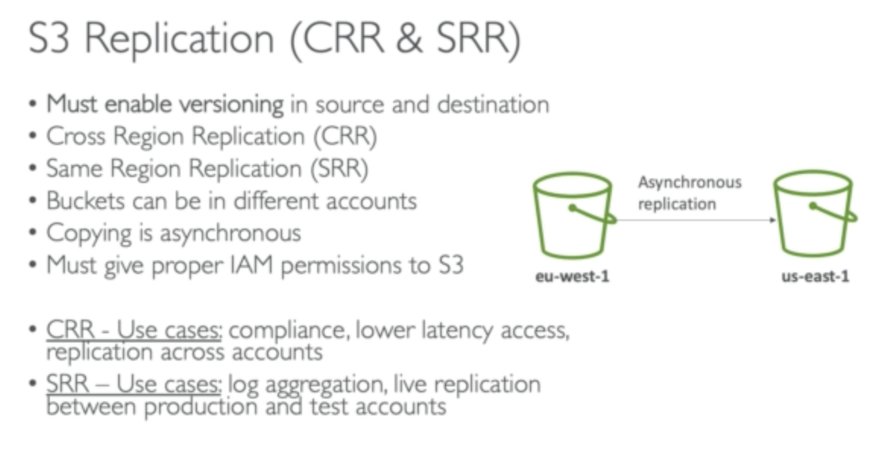
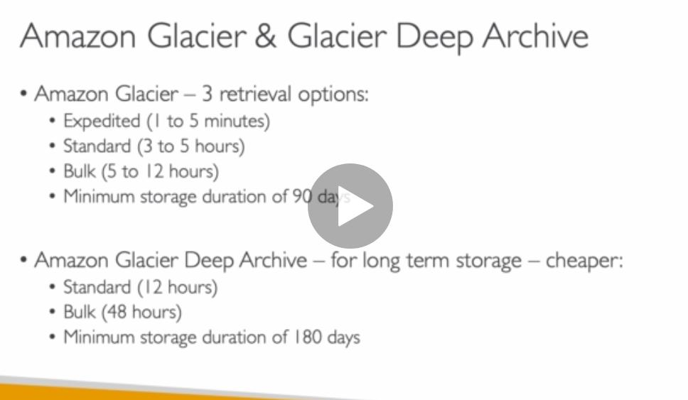

Can enable **S3 MFA delete**, which means that you can't delete your objects in the bucket without the root account permission, plus MFA access with a device.

S3 default encryption make it easy to encrypt objects being uploaded to the bucket and it is the new way for encryption, the old way is through bucket policy and **bucket policy will always be evaluated before** anything.

**S3 Access log**: Don't set the S3 bucket for logging the same as the monitored bucket otherwise the size will grow exponentially.

### S3 Replication

**Version needs to be enabled for this to happen**

**Delete operation is not replicated**

**There is no chaining for buckets**

### S3 storage tiers or classes

- Standard

- IA (Infrequent Access)

- One Zone IA

- Intelligent Tiering

- Glacier (Archive/backup)

- Glacier Deep Archive

## Glacier and Deep Archive

## Life cycle for moving objects between S3 classes

**Transition actions**

**Expiration actions**

**Rules can be created for prefixes**

**Rules can be created for certain object tags**
