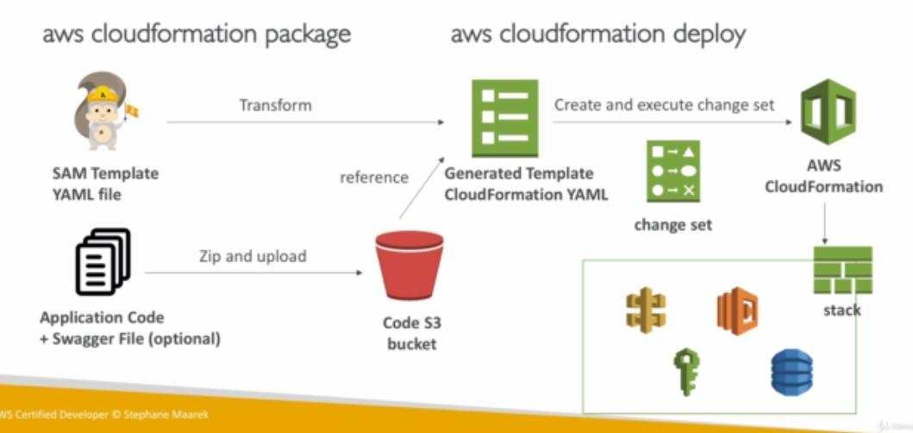

SAM is a framework for developing serverless application, all the configuration are done in .yml. It only has two commands to deploy to AWS, with SAM you can run lambda, dynamoDB and API Gateway locally

### Transform header indicates that it's a SAM template

**Transform: 'AWS::Serverless-blah-blah'**

- **Writing Code**

  - AWS::Serverless::Function
  - AWS::Serverless:: Api
  - AWS: Serverless:: SimpleTable

- **Deploy**
  - aws cloudformation package
  - aws cloudformation deploy

