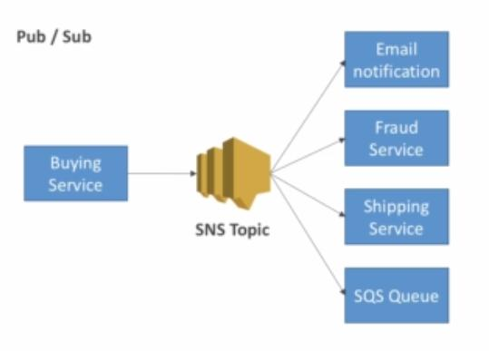

Amazon Simple Notification Service (SNS) is a highly available, durable, secure, fully managed pub/sub messaging service that enables you to decouple microservices, distributed systems, and serverless applications.

Amazon SNS provides topics for high-throughput, push-based, many-to-many messaging. Using Amazon SNS topics, your publisher systems can fan out messages to a large number of subscriber endpoints for parallel processing, including Amazon SQS queues, AWS Lambda functions, and HTTP/S webhooks. Additionally, SNS can be used to fan out notifications to end users using mobile push, SMS, and email.

### SNS integration with other AWS services

**examples:**

1. CloudWatch (alarms)

2. S3 bucket events

3. ASG notifications

### How to publish (within your server using aws-sdk)

- Create a topics

- Create a subscription or many

- Publish to the topic
