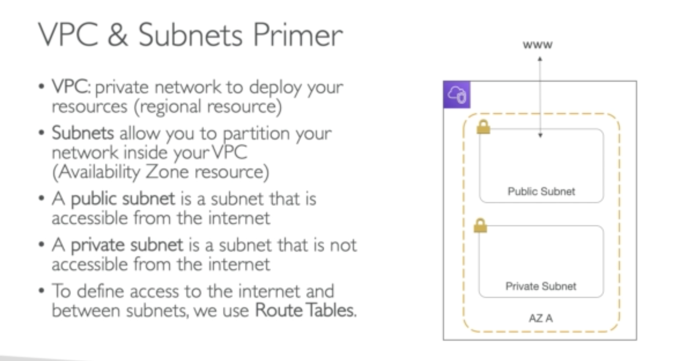
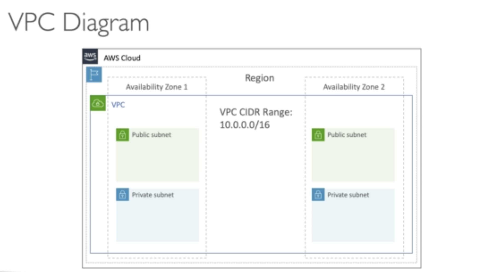
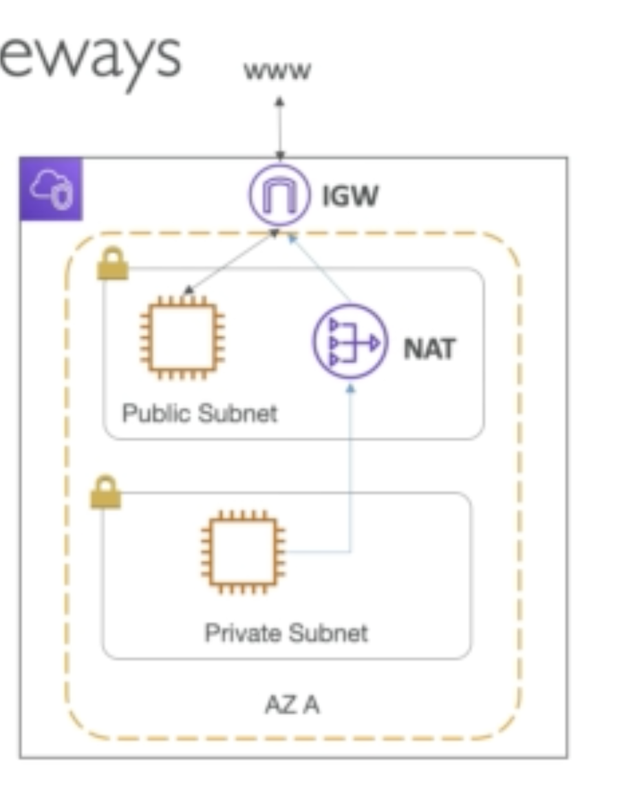
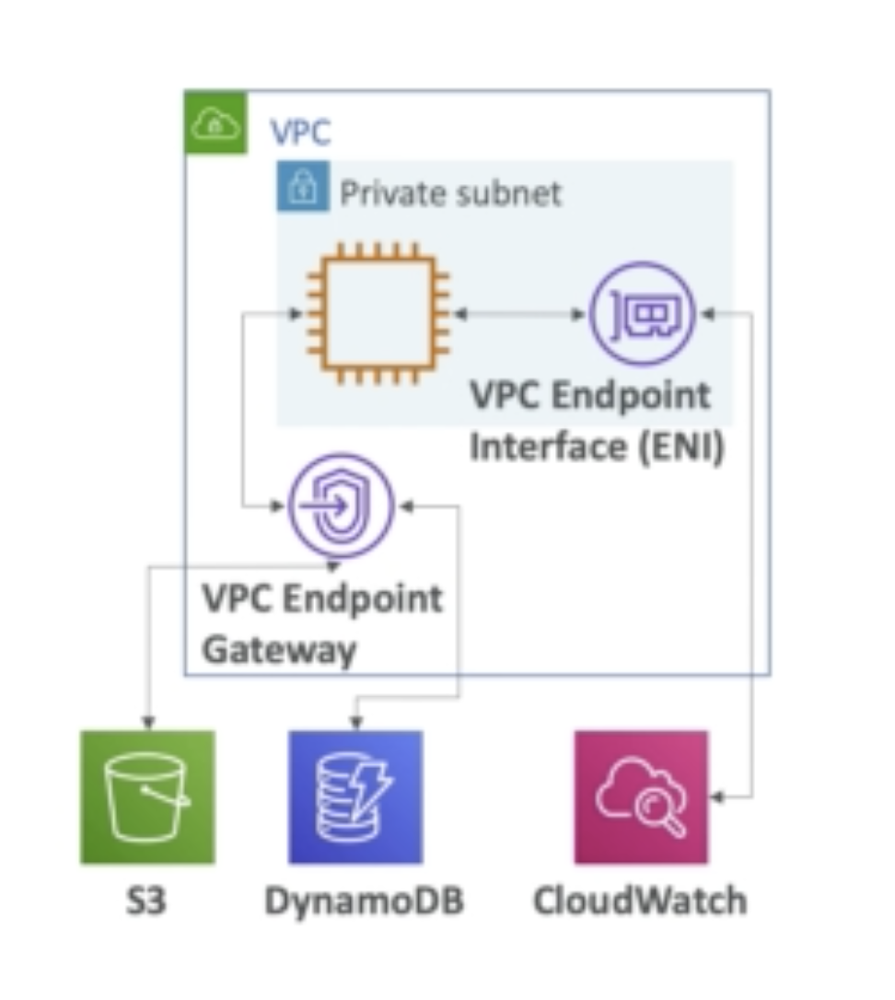
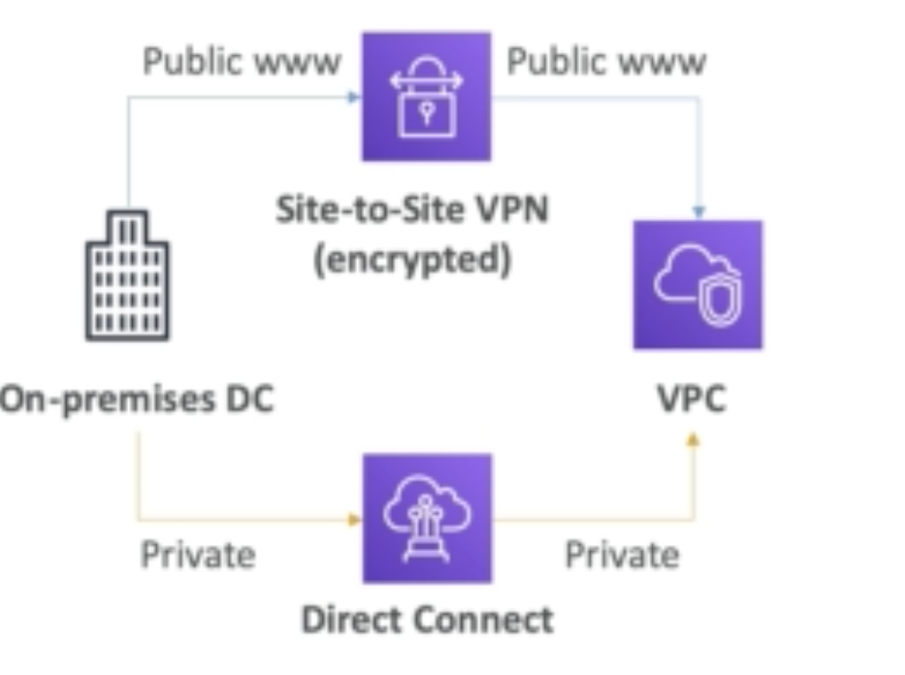

### Things to know for the exam

VPC, Subnet, Internet Gateway and NATS Gateway

Security Groups and Network ACL

VPC peering and VPC endpoints

Site to site VPN and direct connects

## VPC Subnet

We use a Route Table to define access to the internet and the subnets within VPC

Top level view

## Internet Gateway

The public subnet in VPN connects to the Internet Gateway and then Internet Gateway talks to the WWW

## NATS Gateway

Allows private subnets within VPN to access internet while remain private

## VPC Peering

Connect two different VPC to one another and make it like they are on the same network.

In order for this to work, they can't have overlapping IPs

It is also not transitive, must be set up for each VPCs.

## VPC Endpoints **(very important)**

Connect your VPC to AWS services privately not via WWW

Enhance security and lower the latency

## Site to site VPN

Connect your company either via Site to Site VPN or Direct Connect

