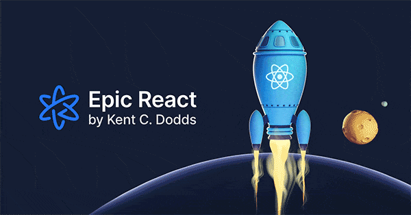

This is an introduction and entry blog for a series of topic coming from Kent C Dodds' Epic react course. I was fortunately enough to have an opportunity to do this course and I will document down what I have learned with the 8 topics that are covered.

### The main 8 topics are:

1. Fundamentals

2. Hooks

3. Advanced Hooks

4. Advanced Patterns

5. Performance

6. Testing

7. Suspense

8. Building an actual app
