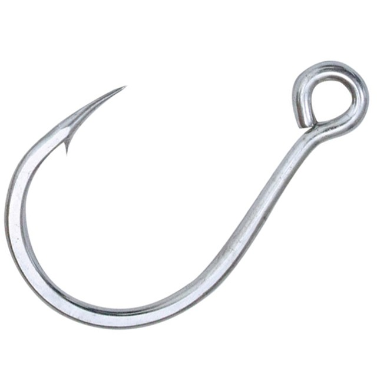

This part is what I really want to look into beside the fundamental section of the Epic React course, as we shift from the class components to the functional components, things change but they don't change much in the fundamental aspect.

It's pretty cool how in the past functional components are considered the dumb components as they can't hold state and are generally used for display only. With the introduction of the newer version of React, we do cool things like **componentDidUpdate**, **componentDidMount** effortlessly with hooks.

### useState

The first kind of special hook that makes the react functional component behaving like a class component.

This function returns a value of values and we use the latest ES6 syntax to destructure and use them.

```javascript
const [yourState, setYourState] = React.useState('');
```

### useEffect

### useContext

### useRef

### useReducer
