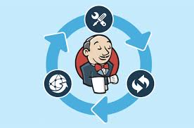

## Intro

Jenkins is a way to implement continuous integration delivery pipeline which automates software delivery through version control right to client.

- initiating code builds
- running automated tests
- deploying to a staging or production environment
