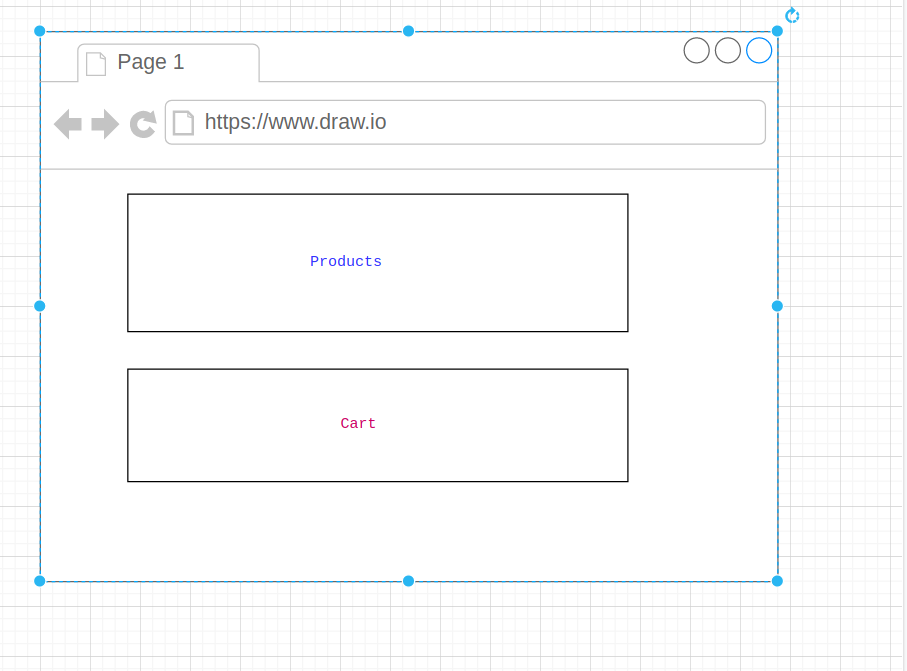

## Intro

You can't talk about micro frontend without knowing something about micro-services. The whole idea is to split the services into its own stand alone api's instead of utilizing the old monolithic architecture like before. With Micro services, you are able to have multiple teams working on different set of api's independently without relying too much on other teams.

What about front end app? Traditionally it's done as one giant code base but with the popularity of the micro services idea, the micro front end concept is born.

## A simple example:

We could have an app that displays a list of products and a shopping cart, with micro front end what that means is that one engineering team could work on the products portion and the other team could work on the cart portion.



There are three parts of this:

- **Container**: Holds **Products** and **Cart**

- **Products**: Stand alone application

- **Cart**: Another stand alone application

It's all made possible with the new feature from Webpack, which is called **Module Federation**

So you would have the container app running on **localhost:8080** and then the product app would run on **localhost:8081** and finally the cart app running on **localhost:8082**

The container app would load the _remote_ module that's running **live** from localhost:8081 and localhost:8082 respectively

## Webpack configuration example:

### Config for Products:

```javascript
const HtmlWebpackPlugin = require('html-webpack-plugin');
const ModuleFederationPlugin = require('./node_modules/webpack/lib/container/ModuleFederationPlugin');
module.exports = {
  mode: 'development',
  devServer: {
    port: 8081,
  },
  plugins: [
    new ModuleFederationPlugin({
      name: 'products',
      filename: 'remoteEntry.js',
      exposes: {
        './ProductsIndex': './src/bootstrap',
      },
      shared: {
        faker: { singleton: true },
      },
    }),
    new HtmlWebpackPlugin({
      template: './dist/index.html',
    }),
  ],
};
```

### Config for Cart

```javascript
const HtmlWebpackPlugin = require('html-webpack-plugin');
const ModuleFederationPlugin = require('./node_modules/webpack/lib/container/ModuleFederationPlugin');
module.exports = {
  mode: 'development',
  devServer: {
    port: 8082,
  },
  plugins: [
    new ModuleFederationPlugin({
      name: 'cart',
      filename: 'remoteEntry.js',
      exposes: {
        './CartShow': './src/bootstrap',
      },
      shared: {
        faker: { singleton: true },
      },
    }),
    new HtmlWebpackPlugin({
      template: './dist/index.html',
    }),
  ],
};
```

### Config for Container

```javascript
const HtmlWebpackPlugin = require('html-webpack-plugin');
const ModuleFederationPlugin = require('./node_modules/webpack/lib/container/ModuleFederationPlugin');

module.exports = {
  mode: 'development',
  devServer: {
    port: 8080,
  },
  plugins: [
    new ModuleFederationPlugin({
      name: 'container',
      remotes: {
        products: 'products@http://localhost:8081/remoteEntry.js',
        cart: 'cart@http://localhost:8082/remoteEntry.js',
      },
    }),
    new HtmlWebpackPlugin({
      template: './dist/index.html',
    }),
  ],
};
```
