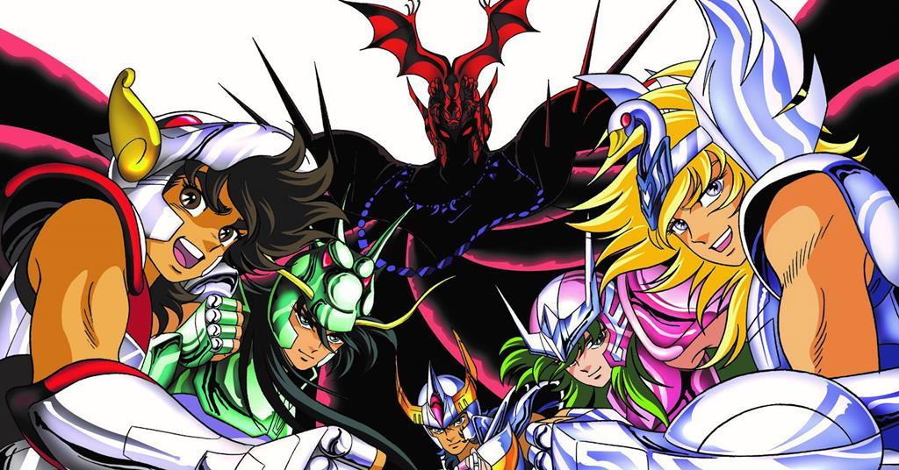

So what is React Portal? Is there something special about it?

From the official definition from the React website:

> Portals provide a first-class way to render children into a DOM node that exists outside the DOM hierarchy of the parent component.

So what are some of the uses for React Porta?

**when we need to render child components outside the normal DOM hierarchy without breaking the event propagation's default behavior through the React component tree hierarchy. This is useful when rendering components such as modals, tooltips and popup messages.**

A quick example:

```javascript
<html>
  <body>
    <div id="app-root"></div>
    <div id="modal-root"></div>
  </body>
</html
```

```javascript
// These two containers are siblings in the DOM
const appRoot = document.getElementById('app-root');
const modalRoot = document.getElementById('modal-root');

class Modal extends React.Component {
  constructor(props) {
    super(props);
    this.el = document.createElement('div');
  }

  componentDidMount() {
    // The portal element is inserted in the DOM tree after
    // the Modal's children are mounted, meaning that children
    // will be mounted on a detached DOM node. If a child
    // component requires to be attached to the DOM tree
    // immediately when mounted, for example to measure a
    // DOM node, or uses 'autoFocus' in a descendant, add
    // state to Modal and only render the children when Modal
    // is inserted in the DOM tree.
    modalRoot.appendChild(this.el);
  }

  componentWillUnmount() {
    modalRoot.removeChild(this.el);
  }

  render() {
    return ReactDOM.createPortal(this.props.children, this.el);
  }
}

class Parent extends React.Component {
  constructor(props) {
    super(props);
    this.state = { clicks: 0 };
    this.handleClick = this.handleClick.bind(this);
  }

  handleClick() {
    // This will fire when the button in Child is clicked,
    // updating Parent's state, even though button
    // is not direct descendant in the DOM.
    this.setState((state) => ({
      clicks: state.clicks + 1,
    }));
  }

  render() {
    return (
      <div onClick={this.handleClick}>
        <p>Number of clicks: {this.state.clicks}</p>
        <p>
          Open up the browser DevTools to observe that the button is not a child
          of the div with the onClick handler.
        </p>
        <Modal>
          <Child />
        </Modal>
      </div>
    );
  }
}

function Child() {
  // The click event on this button will bubble up to parent,
  // because there is no 'onClick' attribute defined
  return (
    <div className="modal">
      <button>Click</button>
    </div>
  );
}

ReactDOM.render(<Parent />, appRoot);
```
